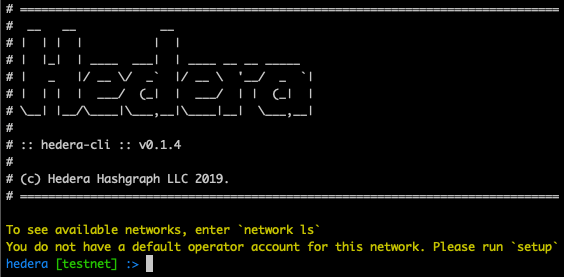

[](https://circleci.com/gh/hashgraph/hedera-cli/tree/master) [](https://www.codacy.com/manual/HederaHashgraph/hedera-cli?utm_source=github.com&utm_medium=referral&utm_content=hashgraph/hedera-cli&utm_campaign=Badge_Coverage) [](LICENSE) [](https://www.codacy.com/manual/HederaHashgraph/hedera-cli?utm_source=github.com&amp;utm_medium=referral&amp;utm_content=hashgraph/hedera-cli&amp;utm_campaign=Badge_Grade) 

# Hedera CLI
This is a simple quick start tool to understand the apis via gRPC that Hedera platform provides.

To get started, you must either have a **`mainnet`** or a **`testnet`** account. 
You can register at [portal.hedera.com](https://portal.hedera.com) to get an *account*, or get another user who already has an account to create one for you.
An *account* looks something like this `0.0.xxxx`. 

## Overview
Hedera currently has 3 services.
1) Crypto service
2) File service
3) Smart contract service

and an upcoming 4th service - Hedera consensus service.

To read what Hedera has to offer, you can check out

1) [docs.hedera.com](https://docs.hedera.com/docs)
2) [hedera.com](https://www.hedera.com)
3) [Hedera's whitepaper](https://www.hedera.com/whitepaper)

### Description
**Release notes:**
Command line changes for cryptotransfer in the latest release version `0.1.0`. Refer to **CryptoTransfer** below

#### Requirements
Java 10/11/12

##### Prerequisites
Hedera CLI works with Java versions 10/11/12.
You can use sdkman to download and manage Java versions [here](https://sdkman.io/usage).

#### Quick Start
There are 2 ways to start Hedera CLI.

The first, download hedera cli via `brew tap` or `curl`.
```bash
# macOS
brew tap hashgraph/tap
brew install hedera-cli

# unix / linux
curl -s https://raw.githubusercontent.com/hashgraph/hedera-cli/master/install.sh | bash
```

To run the hedera shell,
```bash
hedera
```

The other alternative is to clone the repo, `cd` into `hedera-cli` and run `./scripts/build.sh` to build the jar, then to run the hedera shell `./build/libs/hedera-cli-VERSION.jar` with the version number as master branch will always be a moving target.

Once that is running, you should see 



___
___

### Commands

#### Setup operator account
There is the concept of an operator account where the operator can pay for the transaction costs, ie network and node fees.

Cli will prompt `setup` on first run to save default operator key into `~/.hedera`. You will need to have an accountID and 24 words ready.
AccountGetInfo is called during setup to confirm the account exists. This will cost some tinybars.
 
The default operator can be changed anytime by using `account use 0.0.xxxx`.
```bash
# Sets the default operator
setup
```

#### Switch to a specific network
```bash
# To see the list of available networks
network ls

# To change network
network use mainnet
network use testnet
```
#### List Accounts
```bash
# Lists all accounts associated with current network
account ls
```

#### Switch Accounts
```bash
# Switch to use any account that has been recovered and exists in `account ls`
account use 0.0.xxxx
```

#### Recover Accounts
```bash
# Recovering a Hedera account using 24 recovery words, where words are separated by spaces. This is default.
account recovery 0.0.xxxx
```

#### Create Account
Account creation can be done in multiple ways.

Simple Key
1) Creating an account using new recovery words and keypair.
2) Creating an account using operator's keypair.
3) Creating an account using any public key.

MultiSig account creation (not yet supported)

```bash
# Creates a new Hedera account using NEW recovery words and keypair. This is default.
account create -b 100000000

# Creates a new Hedera account using OPERATOR's keypair 
account create -b 100000000 -k
```

#### Delete Account
```bash
# Deletes an account from Hedera, and transfers the remaining funds from the deleted account to the new account
account delete -o 0.0.1001 -n 0.0.1002
account delete --oldAccount 0.0.1001 --newAccount 0.0.1002
```
#### Account Balance
```bash
# Gets the balance of an account
account balance 0.0.xxxx
```

#### Help
```bash
# shows all the available commands
help
```

### VERSION 0.1.0 (Latest)
```bash
# Transfer in tinybars
transfer -s 0.0.1001 -r 0.0.1002 -tb -4400,4400 
transfer --sender 0.0.1001 --recipient 0.0.1002 --recipientAmtTinyBars -4400,4400

transfer -s 0.0.1001,0.0.1002 -r 0.0.1003,0.0.1004,0.0.1005 -tb -440000,-500000,440000,200000,300000 


# Transfer in hbars
transfer -s 0.0.1001 -r 0.0.1002 -hb -4.4,4.4 
transfer --sender 0.0.1001 --recipient 0.0.1002 --recipientAmtHBars -4.4,4.4

transfer -s 0.0.1001,0.0.1002 -r 0.0.1003,0.0.1004,0.0.1005 -hb -4.4,-50,4.4,20,30 
```

### VERSION 0.0.4

#### Crypto Transfer
```bash
# Transfer in tinybars
transfer single -a 0.0.1001 -tb 4400 
transfer single --accountId 0.0.1001 --recipientAmtTinyBars 4400

# Transfer in hbars
transfer single -a 0.0.1001 -hb 0.00044 
transfer single --accountId 0.0.1001 --recipientAmtHBars 0.00044
```

#### Crypto Transfer Multiple
```bash
# Transfer in tinybars
transfer multiple -a 0.0.1001,0.0.1002,0.0.1003 -tb 440000,550000,660000 
transfer multiple --accountId 0.0.1001,0.0.1002,0.0.1003 --recipientAmtTinyBars 44000,55000,66000

# Transfer in hbars
transfer multiple -a 0.0.1001,0.0.1002,0.0.1003 -hb 0.44,1.55,22.66
transfer multiple --accountId 0.0.1001,0.0.1002,0.0.1003 --recipientAmtHBars 0.44,1.55,22.66
```

##### Upcoming commands
```bash

# Creates a new Hedera account using ANY public key 
account create -b 100000000 -pk

# Recovering a Hedera account only using keypairs. (Perhaps you've misplaced your words)
account recovery 0.0.xxxx -k

# Changes the default account 
account use default 0.0.xxxx

# Enable topups (kiv multisig account)
account topup 0.0.xxxx
```